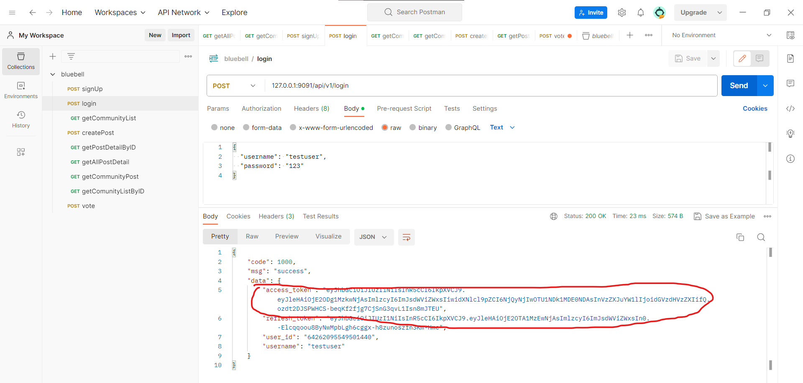

# bluebell
The backend of a online forum, imitating Reddit

The code are constructed in such layer: Controller -> Logic -> DAO

## Features
1. Sign Up
2. Login(with JWT token)
3. Get all community in the forum
4. Create a post in a community
5. Get post detail by its ID
6. Get all the posts in the forum
7. Get all the posts in a community
8. Voting(implemented by Redis)

## Environment
Go 1.20.4  
Redis 7.0.11  
MySQL 8.0.33

## Deployment
### Local
1. Go to settings/config.yaml, modify the configuration as you need
2. `redis-server` (or `redis-server.exe` in Windows)
3. `go build -o main`
4. `./main`

## Using
I use [Postman](https://www.postman.com/) to test the code.  
1. In Postman, import the collection from `postman_json_template/bluebell.postman_collection.json`,
then sign up.

2. Login to get token

3. Except signup and login, every features in bluebell need user to login,
so put the token inside your request

## Todo
1. In voting part, if the insertion into MySQL is successful but the insertion 
into Redis fails, the MySQL insertion should be rolled back.

2. Use refresh-token to get access-token
